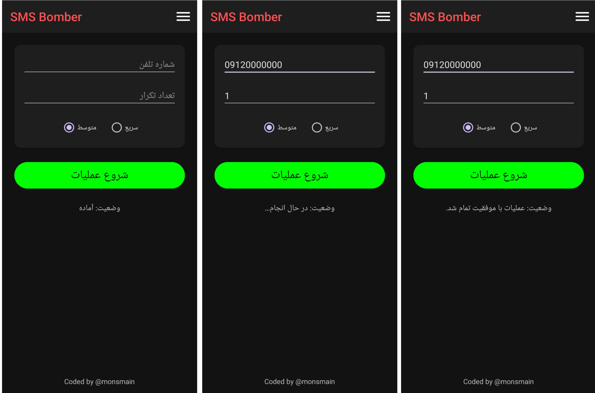

 <h1>اس ام اس بمبر ایرانی</h1>

### **توضیح:** اس ام اس بمبر ابزاری است که برای ارسال تعداد زیادی پیامک به یک شماره تلفن در مدت زمان کوتاه استفاده می شود، به طوری که تلفن به دلیل حجم بالای پیام های دریافتی عملاً از کار می افتد و استفاده از آن مختل می شود.

    

## ویژگی‌ها💫

- **کاربرپسند:** رابط کاربری ساده و آسان
- **ارسال درخواست:** دارای 156 API برای پیام و 6 تا برای تماس💣🔥
- **تنظیم سرعت:** دارای 2 حالت سرعت( تند و متوسط )🛸🚀
## استفاده از ابزار:
- استفاده از این ابزار از طریق 2 روش امکان پذیر است [ترموکس](https://github.com/monsmain/sms-bomber-iran/blob/main/README-Termux.md) یا [برنامه](https://github.com/monsmain/sms-bomber-iran/blob/main/README.md#%D8%AF%D8%A7%D9%86%D9%84%D9%88%D8%AF%EF%B8%8F) 

## دانلود⬇️

    <table>
        <thead align="center">
            <tr>
                <th>سیستم‌عامل / معماری</th>
                <th>سازگاری</th>
            </tr>
        </thead>
        <tbody align="center">
            <tr>
                <td>
                    
                </td>
                <td>5+</td>
            </tr>
        </tbody>
    </table>

## امنیت🔒
![[https://www.virustotal.com/gui/file/2a4011cb72d1ea6845de8e0a999fb0dcd782f10aa3606fecb699d64ff29af909/detection]](images/virustotal.jpg)

## اهدا❤️
اگر این ابزار را برای خود مفید می‌دانید، می‌توانید با اهدای هر مبلغی از آن حمایت کنید
  

## مشارکت
ما همیشه به دنبال بهبود ابزار هستیم! اگر ایده‌ای دارید یا باگ پیدا کردید، لطفاً یک [Issue](https://github.com/monsmain/sms-bomber-iran/issues) جدید ایجاد کنید یا یک [Pull Request](https://github.com/monsmain/sms-bomber-iran/pulls) ارسال کنید.
## سلب مسئولیت
* توسعه‌دهنده این برنامه **هیچ‌گونه مسئولیتی** در قبال نحوه استفاده کاربران از آن بر عهده ندارد. اینکه کاربر چگونه از این ابزار استفاده می‌کند و آیا این استفاده قانونی یا اخلاقی است، **تماماً بر عهده خود کاربر است.**
* با دانلود، یا استفاده از این برنامه ، شما صراحتاً با تمامی موارد ذکر شده در این سلب مسئولیت موافقت می‌نمایید.
